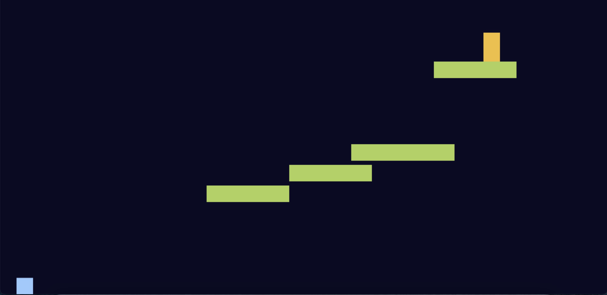

1)What the project does
It is a website based game writing using HTML CSS and JavaScript, user can move the green trangle using movement keyboards. The game will consider win if you touch all the yellow boxes

2)How users can get started with the project
You can download the clone and run html file in your local computer, otherwise, you can click the link 

Where users can get help with your project
3)If you have any thoughts or suggestiones, please contact me through email: yzhang43@usc.edu